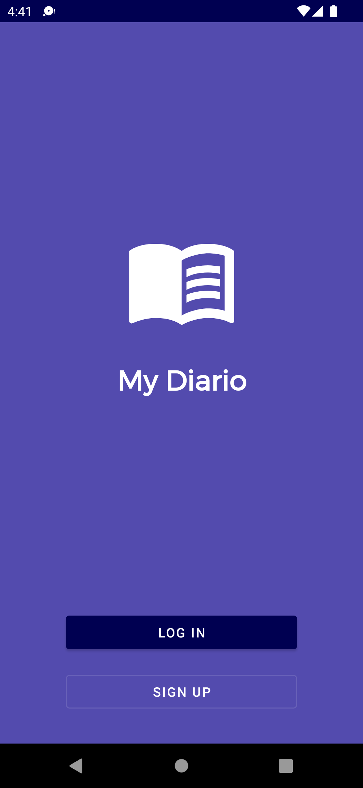
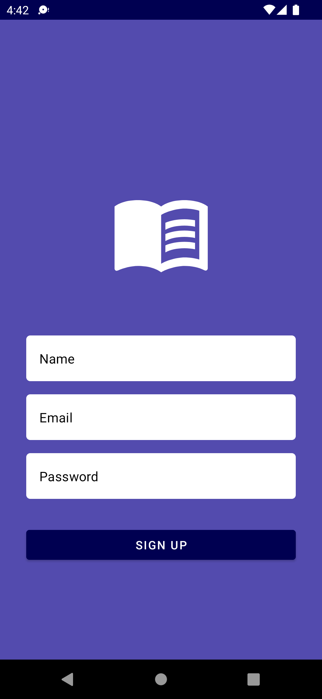
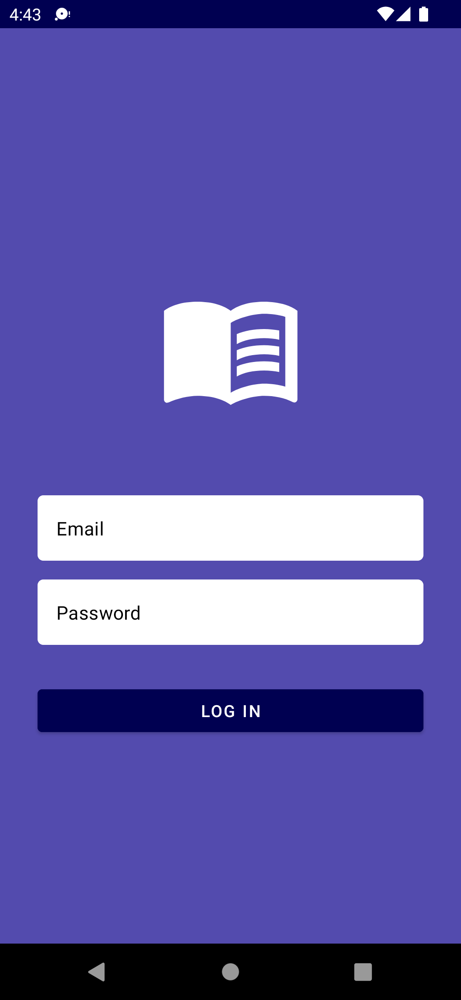
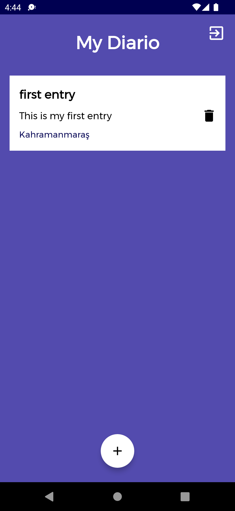
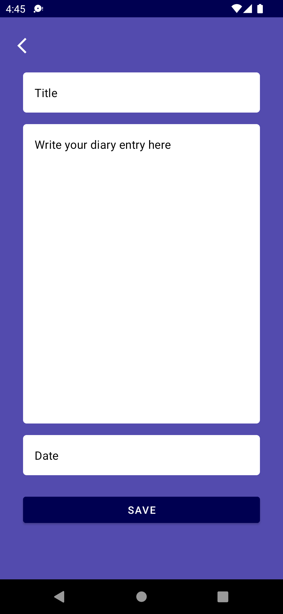

# mydiario_capstone

My diario is a simple diary app which allows users to create an account and save their daily diary
entry in the cloud. The app also allows you to add your current location to the diary entry 

This app demonstrates the following views and techniques:

* [Retrofit](https://square.github.io/retrofit/) to make api calls to an HTTP web service
* [Moshi](https://github.com/square/moshi) which handles the deserialization of the returned JSON to Kotlin data objects

It leverages the following components from the Jetpack library:

* [ViewModel](https://developer.android.com/topic/libraries/architecture/viewmodel)
* [LiveData](https://developer.android.com/topic/libraries/architecture/livedata)
* [Data Binding](https://developer.android.com/topic/libraries/data-binding/) with binding adapters
* [Navigation](https://developer.android.com/topic/libraries/architecture/navigation/) with the SafeArgs plugin for parameter passing between fragments

## Screenshots

> First screen of the app is for the user to choose between login and sign up

> User can register on the sign up screen. Here we are using motion layout to animate the views. We use retrofit and moshi to communicate with 
> the REST API

> User can login to the app in this screen, we also use motion layout here to animate the views

> User can see his diary entries and also delete them  here. We are using room and retrofit here to show the entries

>User can add the diary entry with current location and date in this screen

